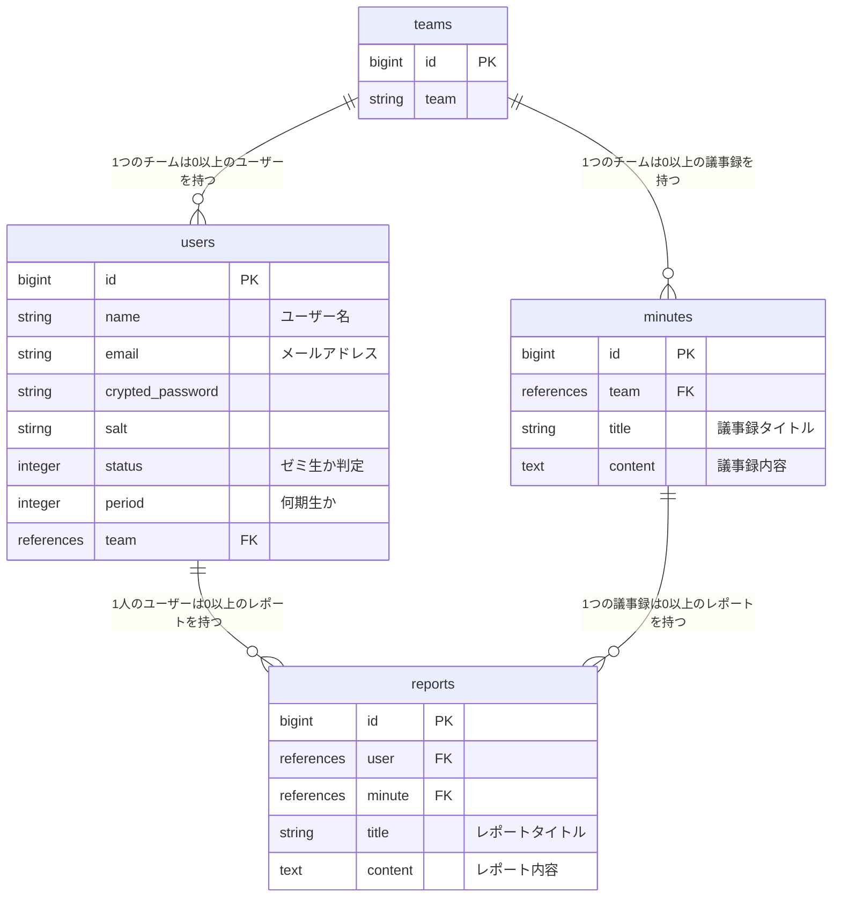

# 議事録アプリ

### ■ サービス概要

ふぁらおゼミの議事録と各メンバーのレポートを閲覧できるサービス

### ■ 実装予定の機能（MVP）

- RUNTEQ 受講生

  - ふぁらおゼミの議事録と各メンバーのレポートを閲覧できる

- ふぁらおゼミ生徒
  - ログイン機能
  - ふぁらおゼミの議事録と各メンバーのレポートを閲覧、編集、削除

### ■ 実装予定の機能（本リリース）※時間に余裕があれば

- RUNTEQ 受講生
  - ユーザーがゼミ内容に関連する Qiita の記事ページに遷移できる
    - 各回のゼミ内容に関するワードで Qiita 記事の自動検索
  - ふぁらおゼミに関する質問を投稿できる
    - ユーザーが投稿した内容を Mattermost のふぁらおゼミチャンネルに飛ばせる
- ふぁらおゼミ生徒
  - （今後もゼミがあると仮定して）議事録、個人レポートの作成、編集、削除、一覧
  - ふぁらおゼミチャンネルに投稿された質問に対する回答

### ■ スケジュール

メイン機能実装：7 月末
β 版を RUNTEQ 内リリース（MVP）：8/10 〆切
本番リリース：8 月末

### ■ 技術選定

- Rails6
- postgresql
- JavaScript
- Bootstrap
- magia
- Notion API
- Qiita API

### ■ 画面遷移図
[Figma](https://www.figma.com/file/VJrl7KO9RicOxZos05q4Xw/zemigiziroku?type=design&node-id=0-1&mode=design&t=DmCYD2zU3iZhYsxP-0)

### ■ テーブル設計

### チーム開発フローで参考になりそうなサイト

- [GitHub と GitHub Desktop を使った小規模チーム開発](https://am1tanaka.hatenablog.com/entry/2015/11/06/130120)
- [Github でチーム開発するためのマニュアル](https://qiita.com/siida36/items/880d92559af9bd245c34)
- [チーム開発における GitHub の使い方 ※ルール設定](https://zenn.dev/ynakashi/articles/0c353cebd34bd6)
- [小規模開発でのタスク管理に便利！github projects の使い方解説](https://gattino.jp/github-projects/)
- [Issue, Pull Request を関連付けて扱う](https://qiita.com/kodai_0122/items/18f7faa80f0302244c51)
- [Git ブランチを削除する方法 (ローカル、リモート)](https://www.freecodecamp.org/japanese/news/how-to-delete-a-git-branch-both-locally-and-remotely/)
