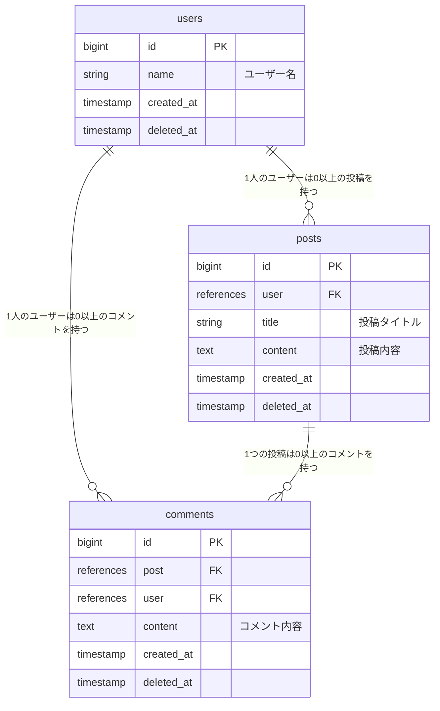

# zemi_giziroku_app

### ■サービス概要
ふぁらおゼミの議事録と各メンバーのレポートを閲覧できるサービス

### ■実装予定の機能（MVP）
- RUNTEQ受講生
    - ふぁらおゼミの議事録と各メンバーのレポートを閲覧できる

- ふぁらおゼミ生徒
    - 合言葉によるログイン
    - ふぁらおゼミの議事録と各メンバーのレポートを閲覧、編集、削除

### ■実装予定の機能（本リリース）※時間に余裕があれば
- RUNTEQ受講生
    - ユーザーがゼミ内容に関連するQiitaの記事ページに遷移できる
        - 各回のゼミ内容に関するワードでQiita記事の自動検索
    - ふぁらおゼミに関する質問を投稿できる
        - ユーザーが投稿した内容をMattermostのふぁらおゼミチャンネルに飛ばせる
        
- ふぁらおゼミ生徒
	- （今後もゼミがあると仮定して）議事録、個人レポートの作成、編集、削除、一覧
	- ふぁらおゼミチャンネルに投稿された質問に対する回答

### ■スケジュール
メイン機能実装：7月末
β版をRUNTEQ内リリース（MVP）：8/10〆切
本番リリース：8月末

### ■技術選定
- Rails6
- postgresql
- JavaScript
- Bootstrap
- magia
- Notion API
- Qiita API

### チーム開発フローで参考になりそうなサイト
- [GitHubとGitHub Desktopを使った小規模チーム開発](https://am1tanaka.hatenablog.com/entry/2015/11/06/130120)
- [Githubでチーム開発するためのマニュアル](https://qiita.com/siida36/items/880d92559af9bd245c34)
- [チーム開発におけるGitHubの使い方 ※ルール設定](https://zenn.dev/ynakashi/articles/0c353cebd34bd6)
- [小規模開発でのタスク管理に便利！github projectsの使い方解説](https://gattino.jp/github-projects/)
- [Issue, Pull Requestを関連付けて扱う](https://qiita.com/kodai_0122/items/18f7faa80f0302244c51)
- [Git ブランチを削除する方法 (ローカル、リモート)](https://www.freecodecamp.org/japanese/news/how-to-delete-a-git-branch-both-locally-and-remotely/)

